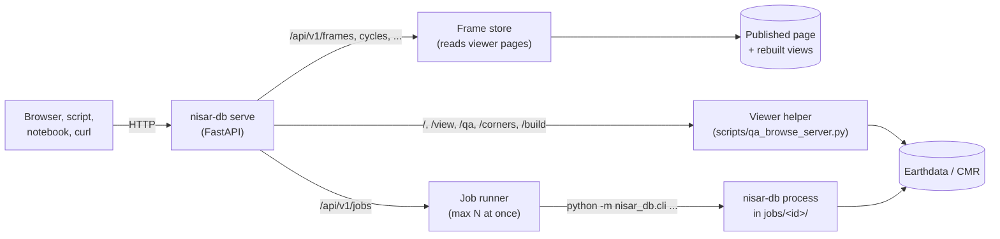

# REST API

`nisar-db serve` starts one web server that does four things:

- **Answers catalog questions** over the frames the [frame viewer](frame-viewer.md)
  shows: which frames match a filter, a frame's granules or GUNW pairs, cycles,
  blackout windows, and summaries.
- **Runs `nisar-db` commands as jobs**, such as `search`, `create-consistent` or
  `create-nisar-catalog`, in the background. You collect the outputs when they
  finish.
- **Serves the viewer**, and builds links that open it in a chosen state.
- **Serves the same tools to AI assistants** over MCP at `/mcp`. See
  [MCP server](mcp.md).
- **Stands in for the viewer helper.** It keeps the QA images, grid corners,
  Earthdata login and search-and-rebuild of `scripts/qa_browse_server.py`, on
  the same paths, so it can replace that script.

It runs in two modes. **Local** is for your own machine: it listens on
127.0.0.1 and asks for no key. **Shared** is a service for a team: callers need
API keys, and the heavy and credentialed parts are limited.

Every route is documented interactively at `/docs` (with a "Try it out" button)
once the server runs. The machine-readable schema is at `/openapi.json`.

## How it works



### Where the answers come from

The API does not keep its own database. Every built viewer page already holds
its frames: their outlines, granule and GUNW lists, consistent mode, blackout
windows, rollout options, flags and QA. That data sits in the page's
`FRAME_DATA` and `META` blocks. The API reads those pages as **datasets**:

- `published` is the checked-in North America page,
  `scripts/opera_nisar_db_viewer.html`;
- every view a rebuild wrote is one more, named like `globe-20261009T193409`,
  from `<cache-dir>/views/`.

A dataset is read on its first query (the 30,000-frame globe takes about
5 seconds) and kept in memory until its file changes. A rebuild therefore shows
up as a new dataset on the next request. The filters are the viewer's own, so
the API and the map always agree on what "cycle 23, mode 4005" means.

### How jobs run

A job is one `nisar-db` subcommand with checked parameters:

1. `POST /api/v1/jobs` validates the parameters against that kind's schema, so
   an unknown field or a wrong type is refused before anything runs. It then
   creates `<cache-dir>/jobs/<id>/` and queues the job.
2. At most `--max-jobs` jobs run at once (2 by default); the rest wait in
   order. Each runs `python -m nisar_db.cli <command> ...` as its own process
   inside its folder. A crash, or a crawl of the whole archive, therefore stays
   out of the server's memory.
3. The folder keeps the outputs, `log.txt`, and a `job.json` record (state,
   command line, times, outputs). The server reloads those records when it
   restarts, and marks any job that was running at the time as failed.
4. `GET /api/v1/jobs/<id>` reports the state and the last log lines.
   `GET .../files/<name>` downloads an output, and `DELETE` cancels.

An input file can be a path on the server, or another job's output written as
`job:<id>/<file>`, so jobs chain without copying files around.

### What a key decides

| | Local mode | Shared mode |
|---|---|---|
| Listens on | 127.0.0.1 only (refuses anything else) | the network (put TLS in front) |
| Catalog queries, viewer | open | open, or need a key with `--private-read` |
| Jobs, rebuilds | open | need a key with the `jobs` scope |
| Whose jobs you see | all | your own; `admin` keys see all |
| Earthdata login | `~/.netrc`, or the viewer's key icon | the server's `~/.netrc` only (page login off) |
| QA images, corners | unlimited | rate limited per client (`--rate-limit`, per minute) |
| Downloads, S3 catalogs | allowed | refused unless `--allow-job` |
| Job input files | any path | only under `catalog/`, the rebuilt views, or job outputs |
| Browser origins (CORS) | any | only `--cors-origin` |

A key is sent as an `X-API-Key: <key>` header or as `Authorization: Bearer <key>`.
A browser can trade one for a cookie with `POST /api/v1/session`. The server
stores only each key's SHA-256 and compares in constant time. A shared server
refuses to start without at least one key.

## Usage

### 1. Install and start

```bash
pip install "nisar_db[api]"          # or, in a checkout: pixi install
cd nisar_db                           # a checkout, for the viewer and rebuilds
nisar-db serve --cache-dir .qa_helper_cache
# or: pixi run nisar_db-api
```

```text
nisar_db API (local) on http://127.0.0.1:8797/  docs: /docs
```

Open `http://127.0.0.1:8797/` for the viewer, or `/docs` to try the routes in
the browser. Without a checkout (a plain `pip install`), the catalog and job
routes still work: pass `--viewer-html <page>` to give them a page to read.

### 2. See what you can query

```bash
API=http://127.0.0.1:8797/api/v1
curl $API/datasets
```

```json
[{"id": "published", "file": "opera_nisar_db_viewer.html", "loaded": false},
 {"id": "globe-20261009T193409", "file": "globe-20261009T193409.html", "loaded": false}]
```

Every catalog route takes `?dataset=<id>`, defaulting to `published`.

### 3. Query frames

```bash
# Ascending frames on track 163, first five
curl "$API/frames?track=163&direction=A&limit=5"

# Frames acquired in cycle 23 in mode 4005, as GeoJSON for QGIS
curl "$API/frames?cycle=23&modes=4005&format=geojson" > cycle23_4005.geojson

# One frame, by id or track_frame
curl "$API/frames/5826"
curl "$API/frames/T34_F19?geometry=true"

# Its GSLC granules in cycles 22-24, or its GUNW pairs
curl "$API/frames/34_19/granules?cycle=22-24"
curl "$API/frames/34_19/granules?product=gunw&start=2026-06-01"

# Blackout windows, the share of each month they cover, reference dates
curl "$API/frames/34_19/blackout"

# Every cycle with its dates and frame count, on the globe rebuild
curl "$API/cycles?dataset=globe-20261009T193409&product=gunw"

# The Consistent Mode Summary and rollout counts for a box
curl "$API/summary?bbox=-125,32,-114,42"
```

The filters match the viewer's sidebar:

| Filter | Values |
|---|---|
| `product` | `gslc` (default) or `gunw`: which lists the entry filters below read |
| `track`, `frame` | numbers, ranges (`10-20`) or lists (`12,34`) |
| `direction` | `A` / `D` |
| `bbox` | west,south,east,north |
| `cycle` | as for `track`; a GUNW pair matches on either of its dates |
| `start`, `end` | `YYYY-MM-DD` |
| `modes`, `pols`, `crids` | comma-separated lists |
| `calval`, `land` | `true` / `false` |
| `rollout` | rollout options; `none` for frames in none |
| `consistent_mode` | a mode such as `4005` |
| `has_data` | `true` keeps only frames with granules or pairs left, `false` only those without |

The cycle, date, mode, polarization and CRID filters act on each frame's
granules (or pairs). As in the viewer, a frame with nothing left drops out, and
each listed frame's `n_selected` counts what is left. Results come in pages
(`limit`, default 500, and `offset`), and `total` gives the full count.

From Python, for example in a notebook:

```python
import geopandas as gpd
import pandas as pd
import requests

api = "http://127.0.0.1:8797/api/v1"

# Frames with an acquisition in cycle 23, as a table
r = requests.get(f"{api}/frames", params={"cycle": "23", "limit": 50000})
frames = pd.DataFrame(r.json()["frames"])
print(frames.groupby("cons_mode").size())

# The same frames on a map
geo = requests.get(f"{api}/frames", params={"cycle": "23", "format": "geojson", "limit": 50000}).json()
gdf = gpd.GeoDataFrame.from_features(geo["features"], crs="EPSG:4326")

# One frame's granules
granules = requests.get(f"{api}/frames/34_19/granules", params={"cycle": "22-24"}).json()["items"]
```

### QA drops and duplicates

Two checks run over each frame's stack.

**QA drops** flag the GUNW pairs (or GSLC acquisitions) whose QA metric falls
far from the stack's median on the metric's bad side, and the dates behind
them:

- **Metrics:** coherence (`cm`, `ca`), valid unwrapped and largest region
  (`v`, `l`), connected components (`n`), ionosphere (`im`, `imd`, `is`,
  `iu`) and RFI likelihood (`rl`, compared on a log scale).
  `GET $API/qa-metrics` lists them with which way is bad.
- **The test:** a robust z-score, the distance from the median in units of
  the median absolute deviation (MAD), so one bad pair cannot hide another.
  Each metric has a smallest meaningful spread, so a stack with almost none,
  for example one component in every pair, is not flagged for a change of one.
- **Temporal baseline:** pairs are compared with pairs of the same baseline
  when there are enough of them, because coherence falls with time.
- **Dates:** a date is flagged when at least `min_pairs` of its pairs (2), and
  `min_share` of them (half), are flagged. A bad acquisition drags down every
  pair it is in.

```bash
curl "$API/frames/13_70/qa-drops?metric=cm"                 # one frame: flagged pairs and dates
curl "$API/frames/13_70/qa-drops?metric=v&threshold=4"      # stricter
curl "$API/qa-drops?metric=cm&track=13"                     # many frames; dates flagged in several frames
curl "$API/qa-drops?metric=rl&product=gslc"                 # GSLC acquisitions by RFI likelihood
```

The scan's `dates` list counts the frames each date is flagged in. A date
flagged in many frames points to a wider event, such as ionosphere, processing
or weather.

**Duplicates** are the same acquisition delivered more than once:

- GSLC granules sharing a date, mode and coverage (the key the catalog's
  `n_unique` counts);
- GUNW pairs sharing both dates, mode and coverage.

Each group gives a reason and the granule to keep (the newest CRID, then the
highest product counter):

- `reprocessed`: different CRIDs;
- `split`: one acquisition delivered in pieces;
- `repeat`: delivered again.

```bash
curl "$API/frames/12_65/duplicates"
curl "$API/duplicates?track=12&start=2026-06-01"
```

### Browse images, and placing them on a map

Each granule has a public browse PNG (GSLC backscatter, GUNW unwrapped phase).
GUNW pairs also have the QA report's layers: `wrapped`, `coherence`,
`coherence_wrapped`, `cc` (connected components), `unwrapped`, `rewrapped`,
`iono` and `iono_unc`. The QA layers need the server's Earthdata login, and
the corners need the viewer helper.

```bash
curl -o b.jpg "$API/browse/<gid>"                          # public browse, as a JPEG (max_side=768)
curl -o c.jpg "$API/browse/<gid>?layer=coherence"          # a QA layer
curl "$API/browse/<gid>/overlay?layer=coherence"           # viewer link + image URL + corners
curl "$API/frames/13_70/qa-drops/images?metric=cm&n=2"     # worst flagged pairs + a typical one
```

`/overlay` returns:

- `viewer_url`: opens the viewer with the image on the map;
- `image_url`: the image itself;
- `coordinates`: the image's corners as lon/lat (top-left, top-right,
  bottom-right, bottom-left), ready for a MapLibre `image` source.

The public browse is placed by its bounding box, and QA layers by the
product's four corners. `qa-drops/images` runs the QA-drop check, then picks the
worst flagged pairs and the unflagged pair closest to the median. Each comes
with its image and overlay URLs, on the layer that shows the metric best:
coherence for `cm` / `ca`, `cc` for `v` / `l` / `n`, `iono` for the
ionosphere metrics.

### Earthquakes and volcanoes

Earthquakes come from the USGS event service, the same feed as the viewer's
earthquake layer. Volcanoes come from the Smithsonian GVP Holocene list the
viewer embeds.

For an earthquake, the API gives:

- the frames over the epicentre, or within `radius_km` of it;
- each frame's **coseismic** GUNW pairs: reference acquisition before the
  event, secondary after it, compared by acquisition time from the granule
  name. Shortest temporal baseline first.

For a volcano, it gives the frames over it and their pairs in a date window.
Each pair comes with browse, overlay and viewer links.

```bash
curl "$API/events/earthquakes?bbox=-100,10,-85,20&start=2026-07-01&min_magnitude=6&order=magnitude"
curl "$API/events/earthquakes?lon=-118.2&lat=34.0&radius_km=200&start=2026-01-01"
curl "$API/events/earthquakes/us7000t1bu/frames?radius_km=50"     # frames + coseismic pairs
curl "$API/events/volcanoes?name=augustine"
curl "$API/events/volcanoes/313010/frames?start=2026-08-01&n_pairs=3"
```

When no pair spans an earthquake yet, the report says so and lists the GSLC
acquisitions just before and after the event.

### Frame health, areas and exports

Several checks are offered for one frame (`/frames/{key}/...`) or as a scan
over the filtered frames:

| Question | One frame | Many frames |
|---|---|---|
| Missed cycles, long gaps, days since the last acquisition | `/frames/{key}/coverage` | `/coverage?stale_days=30` |
| GUNW network: pieces, breaks no pair bridges, unpaired acquisitions | `/frames/{key}/network` | `/network` |
| Next expected passes (12-day repeat; not the acquisition plan) | `/frames/{key}/next-passes` | `/next-passes?lon=&lat=` |
| DISP readiness: usable consistent-mode acquisitions outside blackouts, batches of 15, next batch date | `/frames/{key}/disp-readiness` | `/disp-readiness` |
| A QA metric before, across and after an event | `/frames/{key}/event-qa?when=` | `/events/earthquakes/{id}/compare` |

Areas:

- `GET /aoi?bbox=w,s,e,n` takes a box; `POST /aoi` takes a GeoJSON polygon in
  the body.
- Each frame comes back with the share of the area it covers, its latest
  pair, its next pass and its DISP status. `covered_share` gives the area's
  total coverage.

Exports:

- `/export/frames?format=csv|geojson|kml` writes the filtered frames.
- `/export/entries?product=gunw` writes their GUNW pairs (or GSLC granules) as
  CSV.

```bash
curl "$API/coverage?track=13&stale_days=24"
curl "$API/next-passes?lon=-118.2&lat=34.0"
curl -X POST "$API/aoi" -H 'Content-Type: application/json' -d @my_area.geojson
curl -o frames.kml "$API/export/frames?format=kml&track=13"
curl -o pairs.csv "$API/export/entries?product=gunw&track=13&start=2026-06-01"
```

### DISP-NISAR assets

The DISP-NISAR processing inputs are the consistent-GSLC database, the
blackout and reference dates, and the frame bounds and geometries. The API
serves the real asset files, labelled by where they come from:

- the latest GitHub release;
- the newest `build-disp-assets` job on this server;
- the blackout dates kept in the repo.

```bash
curl "$API/disp/assets"                              # all three sources
curl -OJ "$API/disp/assets/consistent_gslc"          # a local build, else the release
curl "$API/disp/consistent/34_19"                    # one frame's consistent entry
curl "$API/disp/blackout-dates/34_19"
curl "$API/disp/reference-dates/34_19"
curl -X POST "$API/disp/build" -H 'Content-Type: application/json' -d '{}'   # fresh build (minutes)
```

`POST /disp/build` starts a `build-disp-assets` job, which runs the release
workflow's own steps. It is also available as `nisar-db build-disp-assets`:

1. TrackFrame DB;
2. frame bounds;
3. every GSLC in CMR;
4. GSLC catalog;
5. blackout dates;
6. consistent-GSLC with and without blackouts;
7. processing modes;
8. reference dates.

It needs an Earthdata login and, on a shared service, `--allow-job
build-disp-assets`.

### 4. Run a command as a job

`GET $API/jobs/kinds` lists every kind with the JSON schema of its parameters,
and whether this server runs it:

| Kind | Command | Output |
|---|---|---|
| `search` | `nisar-db search` | `results.csv` |
| `create-consistent` | `nisar-db create-consistent` | `consistent.json` |
| `create-blackout-dates` | `nisar-db create-blackout-dates` | `blackout-dates.json` |
| `create-reference-dates` | `nisar-db create-reference-dates` | `reference-dates.json` |
| `create-frame-to-bound` | `nisar-db create-frame-to-bound` | `frame_to_bound.json`, `frames.geojson` |
| `create-nisar-catalog` | `nisar-db create-nisar-catalog` | `catalog/*`, `*.duckdb` |
| `label-processing-mode` | `nisar-db label-processing-mode` | `labelled.json` |
| `query-catalog` | `nisar-db query-catalog` | `matches.csv` |
| `download` | `nisar-db download` | `*.h5` (heavy) |
| `build-s3-catalog` | `nisar-db build-s3-catalog` | `catalog.parquet` (heavy) |

Start one, follow it, and fetch its output:

```bash
curl -X POST $API/jobs -H 'Content-Type: application/json' \
     -d '{"kind": "search", "params": {"product_type": "GSLC", "track": 163, "frame": 22, "max_results": 0}}'
# {"id": "search-20261009T142435-1c7af5", "state": "running", "argv": ["search", ...], ...}

curl $API/jobs/search-20261009T142435-1c7af5
# {"state": "done", "returncode": 0, "outputs": ["results.csv"], "log": [...]}

curl -O $API/jobs/search-20261009T142435-1c7af5/files/results.csv
```

Chain jobs by naming an earlier job's output:

```bash
curl -X POST $API/jobs -H 'Content-Type: application/json' -d '{
  "kind": "create-reference-dates",
  "params": {"consistent_json": "job:create-consistent-20261009T150000-ab12cd/consistent.json",
             "interval": 1.0}}'
```

From Python:

```python
import time
import requests

api = "http://127.0.0.1:8797/api/v1"
job = requests.post(f"{api}/jobs", json={"kind": "search",
                                          "params": {"product_type": "GUNW", "track": 34}}).json()
while (state := requests.get(f"{api}/jobs/{job['id']}").json())["state"] in ("queued", "running"):
    time.sleep(5)
print(state["state"], state["outputs"])
csv = requests.get(f"{api}/jobs/{job['id']}/files/results.csv").text
```

Rebuilding the viewer for North America, the globe or a box keeps its own
route, `POST /build`, with the payload the viewer's magnifier sends (for
example `{"scope": "globe", "flags": true, "qa": true}`). Poll it with
`GET /build`. The result appears as a new dataset and as the page
`/view/<id>`.

### 5. Open the viewer in a given state

The viewer reads its state from the query string when it loads. `GET
$API/viewer/link` checks the parameters and returns the URL:

```bash
curl "$API/viewer/link?dataset=globe-20261009T193409&product=gunw&cycle=20-25&color=gunw_qa_cm&sky=space&play=spin&fullscreen=1"
# {"url": "http://127.0.0.1:8797/view/globe-20261009T193409?product=gunw&cycle=20-25&color=gunw_qa_cm&sky=space&play=spin&fullscreen=1", ...}
```

| Parameter | Sets |
|---|---|
| `product` | `gslc` / `gunw` |
| `opera` | `1` / `0`: the OPERA switch |
| `track`, `frame`, `id`, `cycle`, `start`, `end`, `pass` | the sidebar filters (`pass`: `all`, `asc`, `desc`) |
| `modes`, `pols` | the chips, comma-separated |
| `color` | a *Color frames by* option, e.g. `gslc_count`, `cons_mode`, `gunw_net`, `gunw_qa_cm` |
| `basemap` | `light`, `dark`, `sat`, `sat2` |
| `sky` | `theme`, `white`, `black`, `space` |
| `theme` | `dark` / `light` |
| `center`, `zoom` | `lon,lat` and the map zoom |
| `play` | `spin`, `cycles` or `time`; with `step_days`, `cumulative=1`, `spin=1` |
| `fullscreen` | `1`: the map alone (Esc brings the rest back) |
| `gps` | `1`: the UNR GPS sites |
| `popup` | `0`: no frame popup |
| `browse`, `browse_layer`, `browse_map` | open a granule's browse image (a layer), `browse_map=1` places it on the map |

`GET $API/viewer/params` returns the same list. A page cannot enter the
browser's own full screen without a click, so `fullscreen=1` fills the window
with the map instead.

## Running a shared service

1. **Make keys.** Give each person or tool a key with only the scopes it needs:

    ```bash
    python - <<'EOF'
    import hashlib, json, secrets
    keys = {"alice": ["read", "jobs"], "dashboard": ["read"], "ops": ["admin"]}
    out = []
    for name, scopes in keys.items():
        key = secrets.token_urlsafe(24)
        print(f"{name}: {key}")              # hand this to its owner
        out.append({"name": name, "sha256": hashlib.sha256(key.encode()).hexdigest(), "scopes": scopes})
    json.dump(out, open("api_keys.json", "w"), indent=1)
    EOF
    ```

    The file keeps only the hashes. For a quick test,
    `NISAR_DB_API_KEYS="name:key:read+jobs,..."` works too.

2. **Start the server.** Give it a `~/.netrc` with an Earthdata login for the
   QA images, corners and rebuilds:

    ```bash
    nisar-db serve --mode shared --port 8797 --keys-file api_keys.json \
        --cache-dir /data/nisar_db_api \
        --cors-origin https://opera-adt.github.io \
        --rate-limit 60 --max-jobs 2
    ```

    Add `--private-read` to require a key for every request, and `--allow-job
    download` to let `jobs` keys download granules.

3. **Put TLS in front.** Run a reverse proxy (nginx, Caddy) for HTTPS, so keys
   never cross the network in clear text.

4. **Call it with a key:**

    ```bash
    curl -H "X-API-Key: $KEY" https://nisar-db.example.org/api/v1/jobs
    ```

    ```python
    s = requests.Session()
    s.headers["X-API-Key"] = KEY
    s.post(f"{api}/jobs", json={"kind": "search", "params": {"track": 34}})
    ```

## Settings

| Option | Environment | Default (local / shared) |
|---|---|---|
| `--mode` | `NISAR_DB_API_MODE` | `local` |
| `--host`, `--port` | | `127.0.0.1` / `0.0.0.0`; `8797` |
| `--cache-dir` | | `.qa_helper_cache`: QA images, views, jobs |
| `--viewer-html` | | the checkout's `scripts/opera_nisar_db_viewer.html` |
| `--trackframe-gpkg` | | downloaded when a rebuild needs it |
| `--repo-dir` | | the checkout the package runs from |
| `--keys-file` | `NISAR_DB_API_KEYS_FILE`, `NISAR_DB_API_KEYS` | none / required |
| `--private-read` | | off |
| `--cors-origin` | | any / none |
| `--rate-limit` | | off / 60 per minute |
| `--max-jobs` | | 2 |
| `--allow-job` | | all kinds / not `download`, `build-s3-catalog` |
