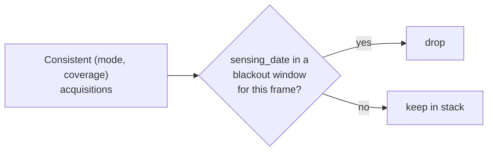

# Background: blackout dates

A **blackout period** is a `[start, end]` date range during which a frame's
acquisitions are *excluded* from the consistent-mode stack. The canonical reason
is **seasonal snow cover**: over a snowed-in frame the interferometric coherence
collapses, so stacking those winter acquisitions only adds noise. Rather than
delete data, we mark those windows and skip them when building the consistent
database.

This is the direct analogue of `burst_db`'s
`opera-disp-s1-blackout-dates-*.json` for Sentinel-1 — same idea, same JSON
shape, keyed by NISAR `frame_idx` instead of DISP-S1 frame ID.

## Where this lives in the code

| Piece | Location |
|---|---|
| JSON builders (three input modes) | [`catalog/create_blackout_dates.py`](https://github.com/opera-adt/nisar_db/blob/main/src/nisar_db/catalog/create_blackout_dates.py) |
| Filter applied during selection | `apply_blackout` / `is_excluded` in [`blackout.py`](https://github.com/opera-adt/nisar_db/blob/main/src/nisar_db/blackout.py) |
| Manual per-frame edits | `append_blackout_dates_json` in [`blackout.py`](https://github.com/opera-adt/nisar_db/blob/main/src/nisar_db/blackout.py) |
| CLI entry points | `nisar-db create-blackout-dates`, `nisar-db append-blackout-dates` |

## The JSON shape

```json
{
  "metadata": {
    "generation_time": "2026-04-22T14:30:25.123456",
    "input_file": "snow_analysis.geojson",
    "output_file": "nisar-blackout-dates-2026-04-22.json"
  },
  "blackout_dates": {
    "1001": [
      ["2025-11-01T00:00:00", "2026-05-31T23:59:59"],
      ["2026-11-01T00:00:00", "2027-05-31T23:59:59"]
    ],
    "1002": [
      ["2025-11-15T00:00:00", "2026-04-30T23:59:59"]
    ]
  }
}
```

Each key is a `frame_idx`; each value is a list of inclusive `[start, end]`
windows. Because snow returns every winter, the builders **pre-compute one window
per calendar year** across a range (default 2025–2030 for NISAR).

## How the windows are built

There are three input modes, all in `create_blackout_dates.py`:

=== "Snow analysis (default)"

    Input: a GeoJSON/Parquet snow-cover analysis table with per-frame
    `start_*` / `end_*` / `blackout_duration_*` columns for `median` and
    `aggressive` strategies. `_select_blackout_dates` picks the **aggressive**
    window when the median blackout would run longer than
    `--max-default-duration` days (default 180), otherwise the **median**
    window. `_yearly_windows` then repeats that month/day window for every year
    in range.

    ```bash
    nisar-db create-blackout-dates \
      --input-file snow_analysis.geojson \
      --max-default-duration 180 \
      --output-file nisar-blackout-dates.json
    ```

=== "Monthly (--monthly)"

    Input: a GeoJSON with `frame_id`, `year`, `month`, `to_process` rows, where
    `to_process == 0` marks a blackout month. Consecutive blacked-out months are
    collapsed into `[start, end]` windows.

    ```bash
    nisar-db create-blackout-dates \
      --input-file monthly_data.geojson --monthly \
      --output-file nisar-blackout-dates.json
    ```

=== "Manual (--manual)"

    No input file: pass month/day windows per frame directly (in code, via
    `manual_blackout_dates`) and let `_yearly_windows` expand them across the
    year range. Useful for one-off exclusions.

    ```bash
    nisar-db create-blackout-dates --manual \
      --start-year 2025 --end-year 2030 \
      --output-file nisar-manual-blackout-dates.json
    ```

## Adding a window by hand

The three builders above regenerate a whole file. For a one-off exclusion -- a
frame affected by an event the snow analysis knows nothing about -- append the
window to an existing JSON instead:

```bash
nisar-db append-blackout-dates \
  --json-file nisar-blackout-dates.json \
  --frame 5827 \
  --period 2025-11-01 2026-05-31 \
  --period 2026-11-01 2027-05-31
```

- `--period` is repeatable and takes an inclusive `START END` pair. Bare dates
  are normalised to `T00:00:00` / `T23:59:59`, so the end day is fully covered;
  pass an explicit time (`2025-11-01T06:00:00`) to keep it.
- The frame entry is created if missing, windows stay sorted by start date, and
  an identical window is never duplicated.
- The file is edited in place (use `--output` to write elsewhere), the
  `.json.zip` sidecar is refreshed (`--no-zip` to skip), and each edit is
  recorded under `metadata.manual_edits` for provenance.
- `--create` starts a new blackout JSON when the file does not exist yet.

From Python, the same thing:

```python
from nisar_db.blackout import append_blackout_dates_json

append_blackout_dates_json(
    "nisar-blackout-dates.json", 5827, [("2025-11-01", "2026-05-31")]
)
```

!!! note "Snow analysis is upstream"
    The snow-cover analysis that produces the input GeoJSON lives outside this
    package (it mirrors `burst_db`'s `snow-analysis/`). `nisar_db` only turns
    that analysis into per-frame yearly windows.

## How the filter is applied

Blackout is enforced at the moment the consistent stack is built. When
`make_consistent_gslc_json` is given a `--blackout-file`, it calls
`apply_blackout` (`blackout.py`), which drops any acquisition whose
`sensing_date` falls inside one of its frame's windows:

```python
def is_excluded(frame_idx, check_date, blackout_periods) -> bool:
    for start_str, end_str in blackout_periods.get(str(frame_idx), []):
        start = datetime.fromisoformat(start_str).date()
        end = datetime.fromisoformat(end_str).date()
        if start <= check_date <= end:
            return True
    return False
```



The result is two useful artifacts, exactly as in `burst_db`:

- **with blackout applied** — the operational stack (snow winters removed);
- **without blackout** — the full record (pass no `--blackout-file`).

See the tutorial for running this step:
**[Build a consistent-mode database → Optional: apply a blackout filter](../tutorials/consistent-mode-database.md#optional-apply-a-blackout-filter)**.
