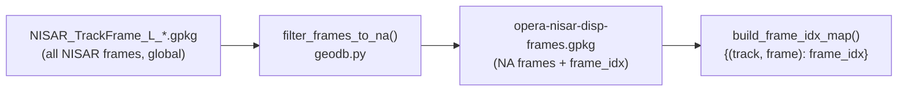
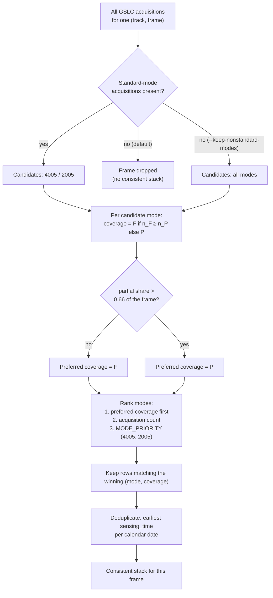
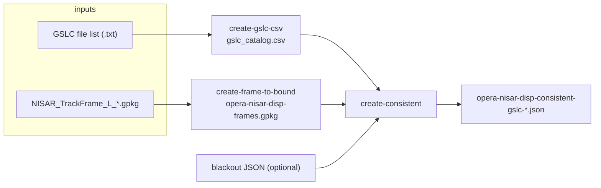

# Background: how consistent mode works

DISP-NISAR forms displacement time series by stacking many GSLC acquisitions of
the **same frame** over time. For that stack to be usable, every acquisition in
it must be *comparable*: acquired in the same imaging geometry, covering the same
ground, and free of duplicates. NISAR, however, is tasked opportunistically — a
single frame can be observed in several **acquisition modes** and with different
**coverage** from one pass to the next.

The **consistent-mode database** is the artifact that resolves this. For every
frame it fixes one `(mode, coverage)` combination and lists the sensing times
that belong to it, so downstream processing has an unambiguous, gap-free stack.

This mirrors `burst_db`'s **consistent-burst database** for Sentinel-1
(`opera-disp-s1-consistent-burst-ids-*.json`). The difference is only the spatial
unit: Sentinel-1 keeps a consistent *set of burst IDs* per frame; NISAR — which
has no sub-frame burst IDs — keeps a consistent *mode + coverage* per frame.

## Where this lives in the code

| Piece | Location |
|---|---|
| Selection logic + JSON writer | [`consistent_gslc.py`](https://github.com/opera-adt/nisar_db/blob/main/src/nisar_db/consistent_gslc.py) |
| Mode constants + voting helper | [`modes.py`](https://github.com/opera-adt/nisar_db/blob/main/src/nisar_db/modes.py) |
| Geographic (North America) filter | [`geodb.py`](https://github.com/opera-adt/nisar_db/blob/main/src/nisar_db/geodb.py) via [`frame_to_bound.py`](https://github.com/opera-adt/nisar_db/blob/main/src/nisar_db/frame_to_bound.py) |
| Filename parsing (`mode`, `coverage`, `location`) | [`filenames.py`](https://github.com/opera-adt/nisar_db/blob/main/src/nisar_db/filenames.py) |
| CLI entry point | `nisar-db create-consistent` |

## What a NISAR GSLC name tells us

The selection reads three fields out of each GSLC granule name (parsed by
`GSLCFilename` in `filenames.py`):

- **`mode`** — a 4-character code, e.g. `4005` or `2005`. Its *family* is the
  first two characters:
    - `40` — standard science mode (e.g. `4005` = 5 m, `4000` = 20 m)
    - `20` — alternate science mode (e.g. `2005`)
    - anything else — engineering / test / non-standard modes
- **`coverage`** — `F` (full frame) or `P` (partial frame).
- **`location`** — the frame's map location tag; not used for selection, but it
  is the field that ties a granule to its place on the ground alongside
  `track`/`frame`.

The standard modes and families are defined once in `modes.py`:

```python
STANDARD_MODES = {"4005", "2005"}
STANDARD_FAMILIES = {"40", "20"}
```

## Location first: restrict to North America

Before any voting happens, the acquisitions are restricted to the frames OPERA
actually processes — those intersecting the **OPERA North America** polygon.



`nisar-db create-frame-to-bound` runs this filter and writes
`opera-nisar-disp-frames.gpkg`, which carries a `frame_idx` column. That
`frame_idx` is the **stable key** used everywhere downstream — in the
frame-to-bound JSON, in the consistent-mode JSON, and in the blackout/reference
files. In `make_consistent_gslc_json` the catalog is inner-joined against this
map, so any acquisition whose `(track, frame)` is outside North America is
dropped before selection (`consistent_gslc.py`).

!!! note "Analogy to Sentinel-1"
    In `burst_db` the equivalent geographic gate is the land/North-America
    filtering applied when frames are built. In both projects the consistent
    database only ever contains frames that OPERA intends to process.

## The selection logic

For each `(track, frame)` group, **every mode present first settles its own
coverage**, then the modes compete for the frame. This is
`_common_mode_coverage` and `select_consistent_acquisitions` in
`consistent_gslc.py`.

### 0. Coverage per mode (full beats partial)

For each `mode`, compare its count of full-frame (`F`) vs partial (`P`)
acquisitions. If there are at least as many `F` as `P`, that mode's coverage is
`F`; otherwise `P`. **Ties go to `F`** — full coverage is preferred.

### 1. Winning mode: coverage first

A mode that resolved to `F` beats one that resolved to `P`. A DISP stack needs
full-frame acquisitions, so coverage outranks the mode code itself: a frame with
`2005_F` and `4005_P` settles on **`2005_F`**.

**Unless the frame is mostly partial.** Preferring `F` costs temporal coverage
when full-frame acquisitions are the rare ones — track 42 / frame 164 is
`4005_P ×4` plus a single `2005_F`, and picking the full one cuts the stack from
four epochs to one. So when partial acquisitions exceed
`PARTIAL_DOMINANCE_THRESHOLD` (**0.66**) of the frame, the preference flips and
`P` ranks first. The threshold is a judgement call, not a derived quantity;
it lives next to `_common_mode_coverage` in `consistent_gslc.py` (and is
mirrored in `generate_scope_viewer.py`).

### 2. Then acquisition count

Among modes with the same coverage, the longer series wins: the number of
acquisitions in the selected `(mode, coverage)` combo. Standard modes are the
only candidates: a frame with **no** standard acquisitions at all has no
consistent stack to offer and is dropped from the output entirely. Pass
`--keep-nonstandard-modes` to keep such frames instead, letting their
non-standard modes compete among themselves.

### 3. Then mode priority

Modes that are level on coverage *and* count are settled by `MODE_PRIORITY`:
`4005` beats `2005`. This is a pure tie-break — it never costs a frame
acquisitions, it only decides which of two equally long series to keep.

!!! note "Why `MODE_PRIORITY` is a tuple, not a set"
    The tie-break used to fall out of set iteration, so the winner depended on
    the interpreter's hash seed and the same catalog could yield two different
    consistent databases on two different runs. An explicit order makes the
    choice reproducible.

### 4. One acquisition per calendar date

If the winning `(mode, coverage)` appears more than once on the same calendar
date, keep only the **earliest** sensing time. This removes intra-day
duplicates so the stack has exactly one epoch per date.

### Worked examples

Real patterns from NISAR data (`count` of acquisitions per `mode_coverage`):

| Frame's acquisitions | Winner | Why |
|---|---|---|
| `4005_F ×5`, `4005_P ×2` | **`4005_F`** | one mode; F majority |
| `4005_P ×7`, `4005_F ×1` | **`4005_P`** | one mode; P majority |
| `2005_F ×4`, `4005_F ×4` | **`4005_F`** | both `F` and level on count; `4005` wins the tie-break (track 163 / frame 11) |
| `2005_F ×4`, `4005_P ×4` | **`2005_F`** | 50% partial; `F` beats `P` before anything else applies |
| `4005_P ×4`, `2005_F ×1` | **`4005_P`** | 80% partial — above the threshold, so `P` wins (track 42 / frame 164) |
| `2005_P ×4`, `4005_P ×1` | **`2005_P`** | both `P`; the longer series wins (track 29 / frame 96) |
| `2005_F ×9`, `4005_F ×2` | **`2005_F`** | both `F`; the count outranks mode priority |
| `0505_F ×3` | *(frame dropped)* | no standard mode; would be `0505_F` with `--keep-nonstandard-modes` (track 1 / frame 52) |



## Output: the consistent-GSLC JSON

`make_consistent_gslc_json` writes `opera-nisar-disp-consistent-gslc-{date}.json`
(plus a `.json.zip`), keyed by `frame_idx`:

```json
{
  "metadata": {
    "generation_time": "2026-07-24T12:00:00",
    "input_catalog": "gslc_catalog.csv",
    "nisar_gpkg": "opera-nisar-disp-frames.gpkg",
    "blackout_file": null,
    "description": "Consistent NISAR GSLC acquisitions per frame. ..."
  },
  "data": {
    "5827": {
      "common_mode": "4005",
      "common_coverage": "F",
      "sensing_time_list": [
        "2025-11-24T13:08:58",
        "2025-12-06T13:08:57"
      ]
    }
  }
}
```

- `common_mode` / `common_coverage` — the fixed choice for the frame.
- `sensing_time_list` — one ISO timestamp per calendar date, in ascending order.

An optional **blackout file** can be passed at this stage; acquisitions whose
date falls inside a frame's blackout window are removed before the JSON is
written (see [Blackout dates](blackout-dates.md)).

## How it fits the wider pipeline



The next page shows how to run this end to end:
**[Build a consistent-mode database](../tutorials/consistent-mode-database.md)**.
