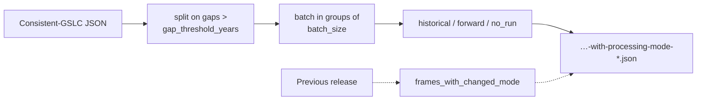

# Background: processing modes (historical / forward)

The [consistent-mode](consistent-mode.md) database says *which* acquisitions
belong to a frame's stack. It does not say which of them the processor can run
**now**, as a complete batch, versus which are still accumulating. That is what
the processing-mode labels add.

This mirrors `burst_db`'s
`opera-disp-s1-consistent-burst-ids-with-processing-mode-*.json` and its
`reconcile_and_label_db.py` step.

## The three labels

DISP processing runs in batches of a fixed size (15 acquisitions, matching
DISP-S1). Walking a frame's sorted sensing times from the beginning:

| Label | Meaning |
|---|---|
| `historical_NN` | Part of a full batch. Processable now, and the result is final. |
| `forward_NN` | The trailing partial batch. Reprocessed as new acquisitions arrive. |
| `no_run` | The frame has never accumulated a full batch. Nothing to run yet. |

`NN` is a group number. It increments after any gap longer than
`--gap-threshold-years` (default 2.0), because a stack cannot span such a gap --
the acquisitions on either side belong to separate time series, and batch
counting restarts.

For a young mission this distribution is lopsided by construction: most NISAR
frames carry one partial batch, so `forward_01` and `no_run` dominate and the
`historical` fraction grows with every release.

## The NISAR reconciliation question

`burst_db` also diffs each release against the previous one, looking for frames
whose `burst_id_list` changed -- a changed burst set invalidates the existing
stack.

NISAR frames have no burst list: the footprint is fixed by the mission. The
equivalent invalidation is the winning **`(common_mode, common_coverage)`**
flipping between releases, since that changes which acquisitions were selected
as consistent. Passing `--previous-json` records those frames under
`metadata.frames_with_changed_mode`.

## Where this lives in the code

| Piece | Location |
|---|---|
| Labeling + reconciliation | [`processing_mode.py`](https://github.com/opera-adt/nisar_db/blob/main/src/nisar_db/processing_mode.py) |
| Sentinel-1 reference (for parity) | `burst_db`'s [`reconcile_and_label_db.py`](https://github.com/opera-adt/burst_db/blob/main/src/burst_db/reconcile_and_label_db.py) |

## Producing it

```bash
nisar-db label-processing-mode \
  --consistent-json opera-nisar-disp-consistent-gslc-2026-07-25.json \
  --previous-json opera-nisar-disp-consistent-gslc-2026-04-25.json \
  --output opera-nisar-disp-consistent-gslc-with-processing-mode-2026-07-25.json
```



## The JSON shape

Identical to the consistent-GSLC document, except that `sensing_time_list`
becomes a mapping from sensing time to label. Every other per-frame field is
carried through unchanged:

```json
{
  "metadata": {
    "processing_mode_params": {
      "batch_size": 15,
      "gap_threshold_years": 2.0,
      "labeling_time": "2026-07-25T12:00:00"
    },
    "frames_with_changed_mode": ["5830"]
  },
  "data": {
    "5827": {
      "common_mode": "4005",
      "common_coverage": "F",
      "sensing_time_list": {
        "2025-01-05T01:23:45": "historical_01",
        "2026-01-12T01:23:45": "forward_01"
      }
    }
  }
}
```
