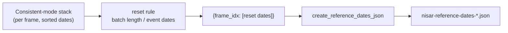

# Background: reference (reset) dates

DISP-NISAR measures displacement *relative to a reference epoch*. If a single
reference were used forever, the processor would keep forming interferograms with
an ever-growing temporal baseline against the very first acquisition — which
decorrelates and becomes unusable. To avoid this, each frame periodically
**resets** its reference to a newer date and starts a fresh batch.

A **reference-date change** (also called a *reset date*) is one of those epochs.
The reference-dates database lists, per frame, the dates at which the InSAR
reference is reset. Frames not listed simply keep their default reference (the
first acquisition).

This mirrors `burst_db`'s `opera-disp-s1-reference-dates-*.json` and its
`opera-db make-reference-dates` step. As the Sentinel-1 documentation puts it,
the reference-date list *"indicates to the processing system that we should start
outputting data with respect to a new reference, to avoid attempting to form very
long temporal-baseline interferograms."* NISAR follows the same convention.

## Why a reset happens

Two operational triggers, both inherited from the Sentinel-1 workflow:

- **Batch length** — after enough acquisitions accumulate (`burst_db` groups
  Sentinel-1 in batches of ~15), a new reference caps interferogram baselines to
  a manageable span.
- **Deformation events / data gaps** — a large earthquake or a long acquisition
  gap makes pre-event/post-event pairs meaningless, so the reference is reset at
  the event. In `burst_db` this is the `EVENT_DATES_BY_FRAME` table (e.g.
  Ridgecrest, `2019-07-06`); NISAR carries per-frame event dates the same way.

## Where this lives in the code

| Piece | Location |
|---|---|
| JSON writer | `create_reference_dates_json` in [`blackout.py`](https://github.com/opera-adt/nisar_db/blob/main/src/nisar_db/blackout.py) |
| Re-exported for back-compat | [`consistent_gslc.py`](https://github.com/opera-adt/nisar_db/blob/main/src/nisar_db/consistent_gslc.py) |
| Sentinel-1 reference (for parity) | `burst_db`'s [`reference_dates.py`](https://github.com/opera-adt/burst_db/blob/main/src/burst_db/reference_dates.py) |

## The JSON shape

Per-frame, keyed by `frame_idx`; each value lists the reset dates in order:

```json
{
  "metadata": {
    "generation_time": "2026-07-24T12:00:00",
    "description": "Per-frame NISAR reference date changes. Each date marks a reset of the InSAR reference epoch (e.g. after a major earthquake or a data gap)."
  },
  "data": {
    "5827": ["2026-01-15"],
    "5830": ["2025-12-01", "2026-06-01"]
  }
}
```

## Producing it

`create_reference_dates_json` takes a `{frame_idx: [dates]}` mapping and writes
the JSON (plus a `.json.zip`). It is currently a Python-API entry point, matching
`burst_db`'s module-first approach:

```python
from nisar_db.blackout import create_reference_dates_json

refs = {
    "5827": ["2026-01-15"],           # reference reset after a data gap
    "5830": ["2025-12-01", "2026-06-01"],
}
create_reference_dates_json(refs, output="nisar-reference-dates.json")
```



## How the processor uses it

The three databases work together and are all keyed by the same `frame_idx`:

1. **[Consistent mode](consistent-mode.md)** fixes *which* acquisitions form the
   stack for a frame.
2. **[Blackout dates](blackout-dates.md)** removes seasonally unusable
   acquisitions from that stack.
3. **Reference dates** tell the processor *when to restart* the reference within
   the surviving stack.

Together they define, for every North America frame, a clean sequence of
acquisitions partitioned into reference-anchored batches — ready for DISP-NISAR
displacement processing.
