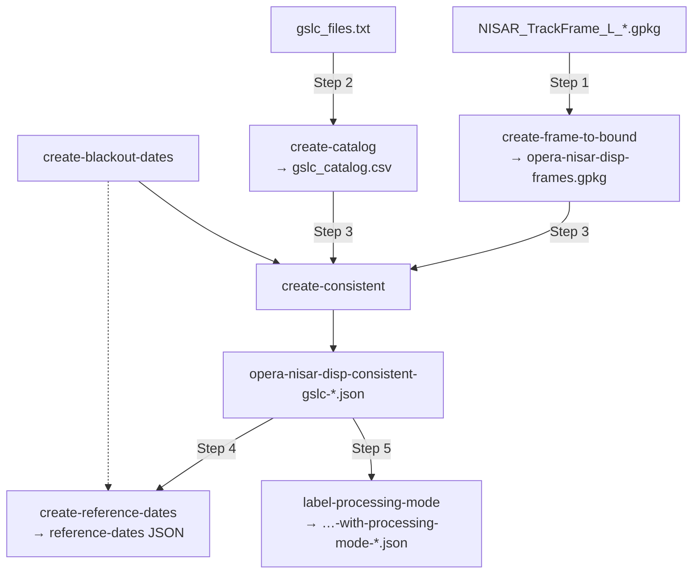

# Tutorial: build a consistent-mode database

This walkthrough produces the **consistent-GSLC (consistent-mode) database** for
NISAR frames over North America, from scratch. Anyone with the two inputs below
can follow it end to end. It mirrors the `make` flow used by `burst_db` for
DISP-S1.

For the *why* behind each step, read
**[Background: how consistent mode works](../background/consistent-mode.md)**.

## What you'll produce

```
opera-nisar-disp-frame-to-bounds-<date>.json(.zip)   # frame bounding boxes
opera-nisar-disp-frames.gpkg                          # NA frames + frame_idx  (side output)
gslc_catalog.csv                                      # parsed GSLC file list
opera-nisar-disp-consistent-gslc-<date>.json(.zip)    # the consistent-mode database
opera-nisar-disp-reference-dates-<date>.json(.zip)    # reference-epoch resets
opera-nisar-disp-consistent-gslc-with-processing-mode-<date>.json(.zip)
```

## Prerequisites

- `nisar_db` installed and the `nisar-db` CLI on your `PATH`
  (see [Install](../index.md#install)).
- Two inputs:

    | Input | What it is | How to get it |
    |---|---|---|
    | `NISAR_TrackFrame_L_YYYYMMDD.gpkg` | Global NISAR track/frame GeoPackage | `nisar-db download-frame-db` (public CMR granule `G3817504902-ASF`) |
    | `gslc_files.txt` | One NISAR GSLC S3 path / granule ID per line | List your GSLC bucket, or `nisar-db search --output-csv` |

!!! tip "Fetching the TrackFrame database"
    `nisar-db download-frame-db` needs only Earthdata Login credentials in
    `~/.netrc`, and reuses the file if it is already there. Step 1 fetches it
    on its own when `--nisar-gpkg` is omitted, so you can skip this if the
    GeoPackage is the only input you are missing.

!!! tip "Getting a GSLC file list"
    Any newline-delimited list of GSLC names works — S3 URIs, local paths, or
    bare granule IDs. For example, from a bucket scan:
    ```bash
    nisar-db build-s3-catalog --bucket my-nisar-bucket \
      --prefix products/L2_L_GSLC/ --output gslc.parquet
    nisar-db query-catalog gslc.parquet --product-type GSLC --output-csv gslc.csv
    # then take the granule_id column into gslc_files.txt
    ```

Work in a clean output directory:

```bash
mkdir -p release && cd release
# place NISAR_TrackFrame_L_YYYYMMDD.gpkg and gslc_files.txt here
```

## Step 1 — Filter frames to North America

Build the frame-to-bound mapping. Its **side output**,
`opera-nisar-disp-frames.gpkg`, is the filtered set of NA frames carrying the
`frame_idx` key that every later step uses.

```bash
nisar-db create-frame-to-bound \
  --nisar-gpkg NISAR_TrackFrame_L_YYYYMMDD.gpkg \
  --output opera-nisar-disp-frame-to-bounds.json
```

Drop `--nisar-gpkg` to download the TrackFrame database first (into `--gpkg-dir`,
the current directory by default):

```bash
nisar-db create-frame-to-bound --output opera-nisar-disp-frame-to-bounds.json
```

Produces:

- `opera-nisar-disp-frame-to-bounds.json` (+ `.json.zip`)
- `opera-nisar-disp-frames.gpkg`  ← needed by Step 3

## Step 2 — Parse the GSLC file list into a catalog

Turn the raw file list into a structured CSV with the `mode`, `coverage`,
`track`, `frame`, and `sensing_time` columns the selection needs. Restrict to
North America with `--na-only`.

```bash
nisar-db create-catalog \
  --input gslc_files.txt \
  --output gslc_catalog.csv \
  --na-only \
  --nisar-gpkg NISAR_TrackFrame_L_YYYYMMDD.gpkg
```

The command prints a `mode_family` and coverage summary so you can sanity-check
the distribution before selecting. Produces `gslc_catalog.csv` (and a
`*_frame_summary.csv`).

## Step 3 — Select the consistent mode per frame

Combine the catalog (Step 2) with the filtered frames GPKG (Step 1). This applies
the [selection logic](../background/consistent-mode.md#the-selection-logic):
dominant mode → majority coverage → one acquisition per date.

```bash
nisar-db create-consistent \
  --catalog gslc_catalog.csv \
  --nisar-gpkg opera-nisar-disp-frames.gpkg \
  --output opera-nisar-disp-consistent-gslc.json
```

Produces `opera-nisar-disp-consistent-gslc.json` (+ `.json.zip`), keyed by
`frame_idx` with `common_mode`, `common_coverage`, and `sensing_time_list` for
each frame. **This is the consistent-mode database.**

### Optional: apply a blackout filter

To remove seasonally unusable acquisitions (e.g. snow winters), pass a
[blackout-dates JSON](../background/blackout-dates.md). First build it — the
`snow_analysis.geojson` input comes from
[Derive blackout dates from snow cover](snow-analysis.md):

```bash
nisar-db create-blackout-dates \
  --input-file snow_analysis.geojson \
  --output-file nisar-blackout-dates.json
```

Then re-run Step 3 with `--blackout-file`:

```bash
nisar-db create-consistent \
  --catalog gslc_catalog.csv \
  --nisar-gpkg opera-nisar-disp-frames.gpkg \
  --blackout-file nisar-blackout-dates.json \
  --output opera-nisar-disp-consistent-gslc-no-snow.json
```

As in `burst_db`, keep **both** the blackout-applied and the unfiltered database:
the filtered one is operational, the unfiltered one is the full record.

## Step 4 — Reference (reset) dates

Add per-frame reference resets so the processor caps interferogram baselines
(see [Reference dates](../background/reference-dates.md)). Passing the blackout
file anchors each frame on a snow-free month:

```bash
nisar-db create-reference-dates \
  --consistent-json opera-nisar-disp-consistent-gslc.json \
  --blackout-file nisar-blackout-dates.json \
  --output opera-nisar-disp-reference-dates.json
```

Without `--blackout-file`, the epochs instead follow each frame's own
acquisition history — a new one every `--interval` years, but only once
`--min-acquisitions` acquisitions have accumulated.

## Step 5 — Processing-mode labels

Mark which acquisitions form complete batches the processor can run now (see
[Processing modes](../background/processing-modes.md)):

```bash
nisar-db label-processing-mode \
  --consistent-json opera-nisar-disp-consistent-gslc.json \
  --previous-json opera-nisar-disp-consistent-gslc-2026-04-25.json \
  --output opera-nisar-disp-consistent-gslc-with-processing-mode.json
```

`sensing_time_list` becomes a `{sensing_time: label}` map of `historical_NN`,
`forward_NN`, and `no_run`. `--previous-json` is optional; it adds
`metadata.frames_with_changed_mode`, the frames whose winning
`(common_mode, common_coverage)` flipped since the last release and whose
existing stack therefore cannot be reused.

## Do it all with `make`

The repository `Makefile` chains every step above (given a catalog CSV, a
`NISAR_TrackFrame_L_*.gpkg`, and a snow-analysis GeoJSON in the current
directory), mirroring `burst_db`'s release build:

```bash
# from a directory containing the .gpkg, gslc_catalog*.csv and snow analysis
make -f /path/to/nisar_db/Makefile
```

That produces the full release asset set: frame-to-bounds, the simplified frame
geometries, blackout dates, both consistent-GSLC variants, the processing-mode
labelled version, and the reference dates. `make help` lists the parameters
(`NISAR_GPKG`, `GSLC_CATALOG`, `SNOW_GEOJSON`, `PREVIOUS_CONSISTENT`) and the
`clean` / `cleanall` targets.

## Do it all from an S3 bucket

`make` starts from a GSLC file list you already have. To go all the way from a
bucket instead, `scripts/prepare_viewer_inputs.py` chains Steps 1-3 and sources
the granules by scanning S3:

```bash
python scripts/prepare_viewer_inputs.py \
  --nisar-gpkg NISAR_TrackFrame_L_YYYYMMDD.gpkg \
  --outdir notebooks --profile saml-pub
```

`--nisar-gpkg` is optional here too; omit it and the TrackFrame database is
downloaded into `--outdir`.

It writes `opera-nisar-disp-frames.gpkg`, `gslc_catalog.duckdb`,
`gslc_catalog.csv`, and `opera-nisar-disp-consistent-gslc-<YYYYMMDD>.json` —
the inputs [the frame viewer](../frame-viewer.md) consumes. Unlike the file-list
route, the DuckDB catalog carries a `production_datetime` column (the S3 object's
`LastModified`, since granule names hold no production time).

The S3 scan takes minutes; `--skip-frames` / `--skip-catalog` reuse existing
artifacts while iterating on the selection step.

## Verify the output

```python
import json, zipfile

with zipfile.ZipFile("opera-nisar-disp-consistent-gslc.json.zip") as z:
    data = json.loads(z.read(z.namelist()[0]))

frames = data["data"]
print(f"{len(frames)} frames")
example = next(iter(frames.values()))
print(example["common_mode"], example["common_coverage"],
      len(example["sensing_time_list"]), "acquisitions")
```

You should see one entry per North America frame, each with a single
`(common_mode, common_coverage)` and a sorted `sensing_time_list` of one epoch
per calendar date — exactly the stack DISP-NISAR will process.

## Recap


