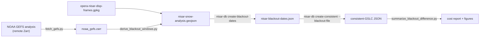

# Tutorial: derive blackout dates from snow cover

This walkthrough produces the **snow-analysis table** that
`nisar-db create-blackout-dates` turns into per-frame blackout windows, then
measures what those windows cost the consistent-mode database.

For the *why* behind blackout windows and the JSON they become, read
**[Background: blackout dates](../background/blackout-dates.md)**.

The scripts live in
[`scripts/snow-analysis/`](https://github.com/opera-adt/nisar_db/blob/main/scripts/snow-analysis),
not in the package: they pull a weather archive and a plotting stack that
`nisar_db` itself does not depend on. This mirrors `burst_db`'s
`snow-analysis/` for DISP-S1, keyed on NISAR `frame_idx` instead of the DISP-S1
`frame_id`.

## What you'll produce

```
noaa_gefs.zarr                       # local GEFS snow + temperature subset
nisar-snow-analysis.geojson          # per-frame blackout windows, 3 strategies
nisar-blackout-dates.json(.zip)      # the yearly windows the filter consumes
figures/*.png                        # what the filter cost, per group
```



## Shortcut — borrow the DISP-S1 windows

Steps 1 and 2 download a weather archive and re-derive the seasons. If all you
need is a table to feed Step 3, `burst_db` already published the same analysis
for DISP-S1 frames, and snow onset and thaw are properties of the ground rather
than of the sensor:

```bash
python scripts/snow-analysis/transfer_disp_s1_windows.py \
  --disp-s1-table https://raw.githubusercontent.com/opera-adt/burst_db/main/snow-analysis/opera-region4-snow-analysis.geojson \
  --frames-gpkg opera-nisar-disp-frames.gpkg \
  --outfile nisar-snow-analysis-from-disp-s1.geojson
```

Each NISAR frame takes the area-weighted mean of the windows of every DISP-S1
frame that overlaps it, averaged in water-year offsets so a
November-to-April window never wraps through the calendar boundary. The output
is Step 2's schema, so Step 3 reads it unchanged — plus `n_donors`,
`donor_coverage` and `winter_coverage` for QC, and minus `n_seasons`, which a
collapsed window table cannot recover.

Two limits worth knowing before you rely on it:

- **Coverage.** DISP-S1's table covers a fixed frame set; NISAR frames outside
  it get no window at all. On the current release that is 344 of 1295 frames,
  none above 37 deg N.
- **Resolution.** Windows are smoothed over the donors of a frame — the spread
  of donor start dates within one NISAR frame runs about a week.

Where either matters, run the real thing from Step 1.

## Prerequisites

- `nisar_db` installed, plus the analysis-only extras:

    ```bash
    pip install -r scripts/snow-analysis/requirements.txt
    ```

- `opera-nisar-disp-frames.gpkg` — the North America frames carrying
  `frame_idx`, the side output of Step 1 of
  [Build a consistent-mode database](consistent-mode-database.md#step-1-filter-frames-to-north-america).

## Step 1 — Fetch the weather

Subset the two fields the filter needs over North America and rechunk them
time-major, so the per-frame timelines in Step 2 read a handful of chunks
instead of the whole cube.

```bash
python scripts/snow-analysis/fetch_gefs.py \
  --email you@example.com \
  --start 2020-01-01 \
  --outfile noaa_gefs.zarr
```

The source is the public Dynamical.org mirror of the NOAA GEFS analysis, which
asks for a contact address in the query string. The default bounding box
(`-180 35 -50 80`) covers the OPERA North America footprint; pass `--bbox` for a
smaller run.

!!! warning "No snow before 2020"
    GEFS carries no snow fields earlier than 2020-01-01. An earlier `--start`
    silently yields all-NaN snow, and the filter then falls back to temperature
    alone.

## Step 2 — Derive the windows

Weekly-aggregated pixels are flagged bad when they carry enough snow days **or**
are cold enough; a week is bad *for a frame* when at least `--mask-fraction` of
its in-frame pixels are flagged. Bad weeks are grouped into water years
(August-July) so a winter spanning New Year stays contiguous, and each year's
`(freeze_start, thaw_end)` runs are collapsed three ways:

| Strategy | Window | Effect |
|---|---|---|
| `conservative` | earliest start, latest end | blacks out the most |
| `median` | median start, median end | the default |
| `aggressive` | latest start, earliest end | blacks out the least |

```bash
python scripts/snow-analysis/derive_blackout_windows.py \
  --gefs-zarr noaa_gefs.zarr \
  --frames-gpkg opera-nisar-disp-frames.gpkg \
  --outfile nisar-snow-analysis.geojson
```

Produces one row per frame: `frame_idx`, `track`, `frame`, `n_seasons`, the
thresholds used, `start_*`/`end_*`/`blackout_duration_*` per strategy, and
`geometry`.

!!! note "The year on those timestamps is meaningless"
    Windows come back stamped 2000/2001 — an artifact of the pivot year that
    keeps a wrapping winter ordered. Only month and day carry meaning;
    `_yearly_windows` re-stamps them per calendar year in Step 3.

Frames with no detected winter keep `NaT` windows and are skipped by the
builder rather than blacked out. A `frame_id` column duplicates `frame_idx`
because the builder reads `frame_id`; the resulting JSON is keyed by
`frame_idx`, matching every other NISAR artifact.

## Step 3 — Build the blackout JSON

`create-blackout-dates` takes the **median** window unless it runs longer than
`--max-default-duration` days, in which case it falls back to the **aggressive**
one, then repeats that month/day window for every year in range.

```bash
nisar-db create-blackout-dates \
  --input-file nisar-snow-analysis.geojson \
  --max-default-duration 180 \
  --start-year 2025 --end-year 2030 \
  --output-file nisar-blackout-dates.json
```

See [Background: blackout dates](../background/blackout-dates.md) for the JSON
shape and the two other input modes (`--monthly`, `--manual`).

## Step 4 — Check what it cost

Build the consistent-mode database twice, with and without the filter — as in
`burst_db`, both are worth keeping — then compare:

```bash
nisar-db create-consistent --catalog gslc_catalog.csv \
  --nisar-gpkg opera-nisar-disp-frames.gpkg \
  --output consistent-gslc-no-blackout.json

nisar-db create-consistent --catalog gslc_catalog.csv \
  --nisar-gpkg opera-nisar-disp-frames.gpkg \
  --blackout-file nisar-blackout-dates.json \
  --output consistent-gslc.json

python scripts/snow-analysis/summarize_blackout_difference.py \
  --all consistent-gslc-no-blackout.json \
  --filtered consistent-gslc.json \
  --frames-gpkg opera-nisar-disp-frames.gpkg \
  --group-by latitude --outdir figures/
```

Prints acquisitions kept and lost per group, how many frames still clear
`--min-stack` (15 by default), and how many lost every acquisition:

```
     NISAR consistent GSLC - after blackout filter (by latitude)
┏━━━━━━━━━━┳━━━━━━━━━━┳━━━━━━━━━━━┳━━━━━━━━━━━┳━━━━━━━━┳━━━━━━━━━━━━━┓
┃ Latitude ┃ # Frames ┃ Acqs kept ┃ Acqs lost ┃ % lost ┃ Frames >=15 ┃
┡━━━━━━━━━━╇━━━━━━━━━━╇━━━━━━━━━━━╇━━━━━━━━━━━╇━━━━━━━━╇━━━━━━━━━━━━━┩
│ <40N     │       82 │     1,473 │     1,316 │   47.2 │          43 │
│ 40-50N   │       45 │       705 │       711 │   50.2 │          18 │
...
```

`--group-by` also takes `mode` (mode+coverage, the default) and `track`; only
`mode` works without `--frames-gpkg`. Add `--no-plots` for the table alone, or
drop `--outdir` to show the figures interactively.

## Tuning the thresholds

`snow_month_filter.py` holds the logic if you want to work interactively:

```python
import geopandas as gpd
import xarray as xr
from snow_month_filter import aggregate_weather, bad_period_mask, plot_frame_timeline

ds = xr.open_zarr("noaa_gefs.zarr", consolidated=False)
agg = aggregate_weather(ds, win="1W").compute()
mask = bad_period_mask(agg, snow_threshold=3, freezing_threshold=-2)

frames = gpd.read_file("opera-nisar-disp-frames.gpkg")
plot_frame_timeline(6187, mask, frames)   # red = blacked out
```

Knobs worth sweeping, in rough order of impact:

| Flag | Default | What it changes |
|---|---|---|
| `--mask-fraction` | `0.5` | How much of a frame must be snowed in for the week to count |
| `--snow-threshold` | `3.0` | Snow days per week at or above which a pixel is flagged |
| `--freezing-threshold` | `-2.0` | Temperature (C) at or below which a pixel is flagged |
| `--window` | `1W` | Aggregation cadence |
| `--temp-var` | `tmax` | Test the weekly max or min temperature |

Use `--frame-idx` or `--tracks` to iterate on a subset before committing to a
full continental run.

!!! tip "Dateline frames"
    The ten NISAR frames crossing +/-180 are stored as two-part MultiPolygons.
    The bad-pixel fraction pools both parts by pixel count, so the small sliver
    on one side cannot outvote the other — a bounding-box subset would instead
    span the globe.
