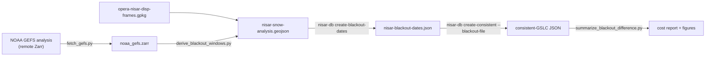

# NISAR snow analysis

The upstream half of the blackout-dates pipeline: turn NOAA GEFS snow and
temperature fields into the per-frame window table that
`nisar-db create-blackout-dates` expects.

This mirrors `burst_db`'s `snow-analysis/` for DISP-S1, keyed on NISAR
`frame_idx` instead of the DISP-S1 `frame_id`. It lives under `scripts/`, not in
the package, because it pulls a weather archive and a scientific plotting stack
that `nisar_db` itself does not depend on.



## Install

```bash
pip install -r scripts/snow-analysis/requirements.txt
```

## 1. Fetch the weather

Subsets the two fields used by the filter over North America and rechunks them
time-major, so the per-frame timelines in step 2 stay fast.

```bash
python scripts/snow-analysis/fetch_gefs.py \
    --email you@example.com \
    --start 2020-01-01 \
    --outfile noaa_gefs.zarr
```

Snow fields are missing before 2020-01-01. The default bounding box
(`-180 35 -50 80`) covers the OPERA North America footprint that `nisar_db`
filters frames to; pass `--bbox` for a smaller run.

## 2. Derive the windows

For each frame, weekly-aggregated pixels are flagged bad when they carry enough
snow days **or** are cold enough; a week is bad for the frame when at least
`--mask-fraction` of its pixels are flagged. Bad weeks are grouped into water
years (August-July) so a winter spanning New Year stays contiguous, and the
per-year `(freeze_start, thaw_end)` runs are collapsed three ways:

| Strategy | Window | Effect |
|---|---|---|
| `conservative` | earliest start, latest end | blacks out the most |
| `median` | median start, median end | the default |
| `aggressive` | latest start, earliest end | blacks out the least |

```bash
python scripts/snow-analysis/derive_blackout_windows.py \
    --gefs-zarr noaa_gefs.zarr \
    --frames-gpkg notebooks/opera-nisar-disp-frames.gpkg \
    --outfile nisar-snow-analysis.geojson
```

Output columns: `frame_idx`, `track`, `frame`, `n_seasons`, the thresholds used,
`start_*`/`end_*`/`blackout_duration_*` per strategy, and `geometry`. The year
on those timestamps (2000/2001) is a pivot artifact -- only month and day carry
meaning. A `frame_id` column duplicates `frame_idx` because the downstream
builder reads `frame_id`; the resulting JSON is keyed by `frame_idx`, matching
every other NISAR artifact.

Frames with no detected winter keep `NaT` windows and are skipped by the
builder rather than blacked out.

## 3. Build the blackout JSON

`_select_blackout_dates` takes the median window unless it runs longer than
`--max-default-duration` days, in which case it falls back to the aggressive
one; `_yearly_windows` then repeats that month/day window for every year in
range.

```bash
nisar-db create-blackout-dates \
    --input-file nisar-snow-analysis.geojson \
    --max-default-duration 180 \
    --start-year 2025 --end-year 2030 \
    --output-file nisar-blackout-dates.json
```

See [`docs/background/blackout-dates.md`](../../docs/background/blackout-dates.md)
for the JSON shape and the other two input modes (`--monthly`, `--manual`).

## 4. Check what it cost

Build the consistent-GSLC database twice, with and without the filter, then
compare:

```bash
nisar-db create-consistent --catalog gslc_catalog.csv \
    --nisar-gpkg notebooks/opera-nisar-disp-frames.gpkg \
    --output consistent-gslc-no-blackout.json

nisar-db create-consistent --catalog gslc_catalog.csv \
    --nisar-gpkg notebooks/opera-nisar-disp-frames.gpkg \
    --blackout-file nisar-blackout-dates.json \
    --output consistent-gslc.json

python scripts/snow-analysis/summarize_blackout_difference.py \
    --all consistent-gslc-no-blackout.json \
    --filtered consistent-gslc.json \
    --frames-gpkg notebooks/opera-nisar-disp-frames.gpkg \
    --group-by latitude --outdir figures/
```

Prints acquisitions kept and lost per group, how many frames still clear
`--min-stack` (15 by default), and how many lost every acquisition. Add
`--no-plots` for the table alone.

## Tuning

`snow_month_filter.py` holds the logic if you want to work interactively:

```python
import geopandas as gpd
import xarray as xr
from snow_month_filter import aggregate_weather, bad_period_mask, plot_frame_timeline

ds = xr.open_zarr("noaa_gefs.zarr", consolidated=False)
agg = aggregate_weather(ds, win="1W").compute()
mask = bad_period_mask(agg, snow_threshold=3, freezing_threshold=-2)

frames = gpd.read_file("notebooks/opera-nisar-disp-frames.gpkg")
plot_frame_timeline(6187, mask, frames)  # red = blacked out
```

Knobs worth sweeping, in rough order of impact: `--mask-fraction` (how much of a
frame must be snowed in), `--snow-threshold`, `--freezing-threshold`, and the
`--window` cadence. Dateline-crossing frames are stored as two-part
MultiPolygons; the fraction pools both parts by pixel count, so the sliver on
one side cannot outvote the other.
